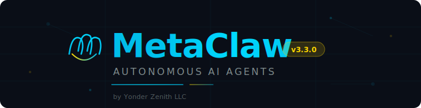
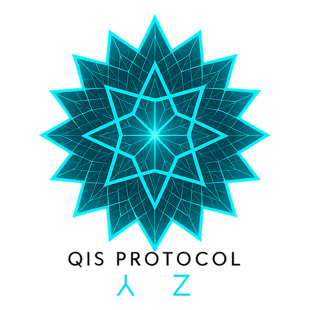
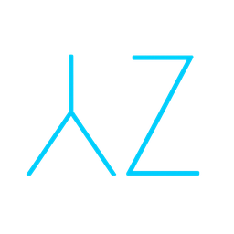

<p align="center">
  
</p>

<p align="center">
  
</p>

<p align="center">
  <strong>Autonomous AI Agents — Plug & Play</strong><br/>
  <em>Deploy self-improving AI agents in minutes, not months.</em>
</p>

<p align="center">
  <a href="#quick-start"></a>
  <a href="https://yonderzenith.github.io/MetaClaw/"></a>
  <a href="LICENSE"></a>
  
</p>

<p align="center">
  
  
  
  
  
</p>

---

## What is MetaClaw?

MetaClaw is an **autonomous agent factory**. Pick an agent template, answer a few questions, and MetaClaw researches best practices, scaffolds the entire project, configures safety guardrails, builds a real-time dashboard, and launches your agent — all automatically.

Your agents don't just run. They **learn, adapt, and improve themselves** through prompt versioning, A/B testing, and automatic optimization — governed by constitutional principles you define.

```
  ╔══════════════════════════════════════════════════════════════╗
  ║                                                              ║
  ║   You describe what you need.                                ║
  ║   MetaClaw builds the agent.                                 ║
  ║   The agent improves itself.                                 ║
  ║                                                              ║
  ╚══════════════════════════════════════════════════════════════╝
```

### Built on Claude Code — Runs on Your Max/Pro Subscription

> **No API keys. No per-token billing. No surprise invoices.**
>
> MetaClaw is powered by **Claude Code CLI**, which means your agents run on your existing **Claude Max or Pro subscription** at a flat monthly rate. While other agent frameworks rack up per-token API costs, MetaClaw agents run unlimited on what you're already paying for.

---

## Quick Start

```bash
# Clone and run — that's it
git clone https://github.com/YonderZenith/MetaClaw.git
cd MetaClaw
npm install
npm start
```

Or on Windows — just double-click **`setup.bat`**.

The installer handles everything: detects your system, installs prerequisites, walks you through configuration, and deploys your agent.

---

## Agent Types

<table>
<tr>
<td width="20%" align="center">
<h3>🎯</h3>
<strong>Outreach Claw</strong><br/>
<sub>Email prospecting, follow-ups, auto-reply campaigns</sub>
</td>
<td width="20%" align="center">
<h3>🔬</h3>
<strong>Research Claw</strong><br/>
<sub>Deep web research, source synthesis, report generation</sub>
</td>
<td width="20%" align="center">
<h3>🛡️</h3>
<strong>Support Claw</strong><br/>
<sub>Inbox monitoring, ticket triage, intelligent auto-response</sub>
</td>
<td width="20%" align="center">
<h3>📡</h3>
<strong>Social Claw</strong><br/>
<sub>Content creation, scheduling, engagement tracking</sub>
</td>
<td width="20%" align="center">
<h3>⚡</h3>
<strong>Custom Claw</strong><br/>
<sub>Describe what you need — Claude configures it</sub>
</td>
</tr>
</table>

---

## Architecture

Every MetaClaw agent is a **self-contained autonomous system** with a file-based brain:

```
                    ┌─────────────────────────────────┐
                    │         CLAUDE.md                │
                    │    (Agent Identity + Rules)      │
                    └────────────┬────────────────────┘
                                 │ reads on every cycle
                    ┌────────────▼────────────────────┐
                    │         SOUL.md                  │
                    │   (Constitutional Principles)    │
                    └────────────┬────────────────────┘
                                 │
              ┌──────────────────┼──────────────────┐
              │                  │                  │
     ┌────────▼───────┐ ┌───────▼────────┐ ┌───────▼───────┐
     │   state.json   │ │  tasks.json    │ │  memory/      │
     │  (Agent State) │ │  (Task Queue)  │ │  (Knowledge)  │
     └────────┬───────┘ └───────┬────────┘ └───────┬───────┘
              │                 │                   │
              └─────────────────┼───────────────────┘
                                │
                    ┌───────────▼──────────────┐
                    │      agent.ts            │
                    │   (13-Step Main Loop)    │
                    │                          │
                    │  ┌─ health-check.ts      │
                    │  ├─ safety.ts            │
                    │  ├─ self-improve.ts      │
                    │  ├─ db.ts (SQLite)       │
                    │  └─ cron-manager.ts      │
                    └───────────┬──────────────┘
                                │
                    ┌───────────▼──────────────┐
                    │     dashboard.html       │
                    │   (Real-time Command     │
                    │    Center + Voice)       │
                    └──────────────────────────┘
```

---

## What Every Agent Gets

<table>
<tr>
<td>

**Core Engine**
- 13-step autonomous main loop
- SQLite database (WAL mode, 11 tables)
- Structured JSONL logging with 30-day rotation
- Health checks on every cycle

</td>
<td>

**Safety First**
- Circuit breakers with configurable thresholds
- Rate limiting (daily + hourly caps)
- Constitutional principles (SOUL.md)
- Dry-run mode for testing

</td>
</tr>
<tr>
<td>

**Self-Improvement**
- Prompt versioning and A/B testing
- Automatic strategy optimization
- Performance metrics tracking
- Logic logging for decision auditing

</td>
<td>

**Operations**
- HTML Command Center with voice control
- Windows Task Scheduler integration
- Auto-start on boot
- Desktop shortcut deployment

</td>
</tr>
</table>

---

## Generated Agent Structure

```
my-agent/
├── CLAUDE.md              # Agent identity, rules, and context
├── SOUL.md                # Constitutional principles
├── dashboard.html         # Command Center (open in browser)
├── src/
│   ├── agent.ts           # Main 13-step autonomous loop
│   ├── db.ts              # SQLite database layer
│   ├── safety.ts          # Circuit breaker + rate limits
│   ├── self-improve.ts    # Prompt evolution engine
│   ├── health-check.ts    # System validation
│   └── cron-manager.ts    # Scheduled task management
├── data/
│   ├── state.json         # Live agent state
│   ├── tasks.json         # Human + AI task tracking
│   └── logs/              # Structured JSONL logs
├── scripts/
│   ├── launch.bat         # Start agent
│   └── agent-cycle.bat    # Autonomous cron cycle
└── memory/                # Agent knowledge files
```

---

## Optional: QIS Intelligence Network

<p align="center">
  
</p>

MetaClaw agents can optionally connect to the **QIS (Quadratic Intelligence Swarm) Network** — a shared knowledge layer where agents deposit and query operational insights.

```
  Agent A ──deposit──▶ ┌──────────────┐ ◀──query── Agent C
                       │  QIS Relay   │
  Agent B ──deposit──▶ │  (Buckets)   │ ◀──query── Agent D
                       └──────────────┘
```

- **No PII** flows through the network — only anonymized operational intelligence
- All personal data (emails, contacts, transcripts) **stays on your machine**
- The QIS Intelligence Network is a separate service operated by Yonder Zenith LLC

> The QIS Protocol is protected by 39 pending US patent applications.
> See [QIS Protocol License](https://yonderzenith.github.io/QIS-Protocol-Website/licensing.html) for details.

---

## Requirements

| Requirement | Details |
|------------|---------|
| **Node.js** | v18 or higher (installer helps you get it) |
| **Claude Code CLI** | Installed globally (installer helps you get it) |
| **Claude Access** | Claude Max or Pro subscription required (or Anthropic API key) |
| **OS** | Windows 10/11 (macOS/Linux support coming) |

---

## Commands

```bash
npm start              # Launch installer / start agent
npm run dry-run        # Test without taking actions
npm run status         # Check agent status
npm run dashboard      # Regenerate dashboard
npm run health-check   # Run system validation
npm run self-update    # Trigger self-optimization
```

---

## License

MetaClaw is released under the **[MIT License](LICENSE)** — use it, modify it, build on it.

The optional QIS Intelligence Network is a separately licensed service by Yonder Zenith LLC.

---

<p align="center">
  <br/>
  <sub>Built by <a href="https://yonderzenith.github.io/QIS-Protocol-Website/"><strong>Yonder Zenith LLC</strong></a></sub><br/>
  <sub><em>Redefining the Horizon</em></sub>
</p>
